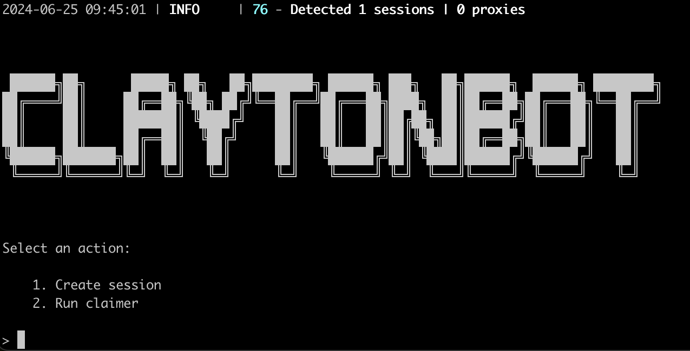

# Bot for [Clayton](https://alexell.ru/cc/clayton)



> 🇷🇺 README на русском доступен [здесь](README-RU.md)

## Functionality
| Feature                                                        | Supported  |
|----------------------------------------------------------------|:----------:|
| Multithreading                                                 |     ✅     |
| Binding a proxy to a session                                   |     ✅     |
| Automatic farming                                              |     ✅     |
| Automatic games (Stack and 512)                                |     ✅     |
| Docker                                                         |     ✅     |

## [Options](https://github.com/Alexell/ClaytonBOT/blob/main/.env-example)
| Option                  | Description                                                                |
|-------------------------|----------------------------------------------------------------------------|
| **API_ID / API_HASH**   | Platform data from which to launch a Telegram session (stock - Android)    |
| **ERRORS_BEFORE_STOP**  | The number of failed requests after which the bot will stop                |
| **USE_PROXY_FROM_FILE** | Whether to use proxy from the `bot/config/proxies.txt` file (True / False) |

You can obtain the **API_ID** and **API_HASH** after creating an application at [my.telegram.org/apps](https://my.telegram.org/apps)

## Quick start
### Windows
1. Ensure you have **Python 3.10** or a newer version installed.
2. Use `INSTALL.bat` to install, then specify your API_ID and API_HASH in the .env file.
3. Use `START.bat` to launch the bot (or in the console: `python main.py`).

### Linux
1. Clone the repository: `git clone https://github.com/Alexell/ClaytonBOT.git && cd ClaytonBOT`
2. Run the installation: `chmod +x INSTALL.sh START.sh && ./INSTALL.sh`, then specify your API_ID and API_HASH in the .env file.
3. Use `./START.sh` to run the bot (or in the console: `python3 main.py`).

## Running in Docker
```
$ git clone https://github.com/Alexell/ClaytonBOT.git
$ cd ClaytonBOT
$ cp .env-example .env
$ nano .env # specify your API_ID and API_HASH, the rest can be left as default
```
### Docker Compose (recommended)
```
$ docker-compose run bot -a 1 # first run for authorization (override arguments)
$ docker-compose start # start in background mode (default arguments: -a 2)
```
### Docker
```
$ docker build -t clayton_bot .
$ docker run --name ClaytonBOT -v .:/app -it clayton_bot -a 1 # first run for authorization
$ docker rm ClaytonBOT # remove container to recreate with default arguments
$ docker run -d --restart unless-stopped --name ClaytonBOT -v .:/app clayton_bot # start in background mode (default arguments: -a 2)
```

## Manual installation
You can download [**Repository**](https://github.com/Alexell/ClaytonBOT) by cloning it to your system and installing the necessary dependencies:
```
$ git clone https://github.com/Alexell/ClaytonBOT.git
$ cd ClaytonBOT

# Linux
$ python3 -m venv venv
$ source venv/bin/activate
$ pip3 install -r requirements.txt
$ cp .env-example .env
$ nano .env # specify your API_ID and API_HASH, the rest can be left as default
$ python3 main.py

# Windows (first, install Python 3.10 or a newer version)
> python -m venv venv
> venv\Scripts\activate
> pip install -r requirements.txt
> copy .env-example .env
> # specify your API_ID and API_HASH, the rest can be left as default
> python main.py
```

Also for quick launch you can use arguments:
```
$ python3 main.py --action (1/2)
# or
$ python3 main.py -a (1/2)

# 1 - Create session
# 2 - Run claimer
```

## Running a bot in the background (Linux)
```
$ cd ClaytonBOT

# with logging
$ setsid venv/bin/python3 main.py --action 2 >> app.log 2>&1 &

# without logging
$ setsid venv/bin/python3 main.py --action 2 > /dev/null 2>&1 &

# Now you can close the console, and the bot will continue its work.
```

### Find the bot process
```
$ ps aux | grep "python3 main.py" | grep -v grep
```